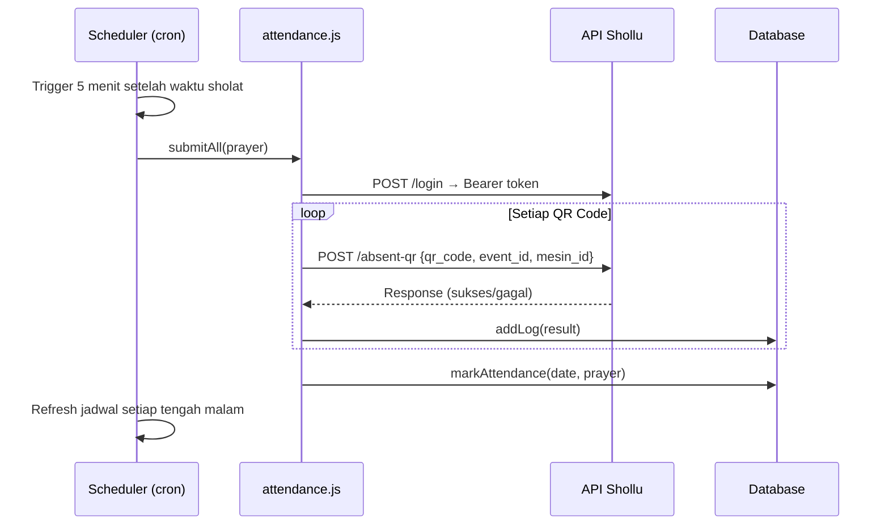

# Shollu Bot

**Bot absensi sholat otomatis** yang terintegrasi dengan platform [Shollu](https://shollu.com). Absen sholat 5 waktu + Tarawih secara otomatis menggunakan QR code — tanpa perlu interaksi manual setiap waktu sholat.

---

## Fitur Utama

- **Absen Otomatis** — Scheduler berbasis cron yang mengirim absensi tepat waktu untuk semua QR code yang terdaftar
- **Multi QR Code** — Dukung banyak anggota/jamaah sekaligus dalam satu instance
- **Jadwal Sholat Otomatis** — Pilih sumber waktu sholat: manual atau otomatis via API [Aladhan](https://aladhan.com)
- **Dukungan Tarawih** — Absen Tarawih via endpoint terpisah, bisa diaktifkan saat Ramadan
- **Dashboard Web** — Antarmuka modern berbasis Next.js untuk monitoring dan konfigurasi
- **Statistik Kehadiran** — Lacak streak, persentase kehadiran, dan riwayat per waktu sholat
- **Export / Import Data** — Backup dan restore seluruh data (QR code, riwayat, pengaturan)
- **Zona Waktu Fleksibel** — Mendukung WIB, WITA, dan WIT
- **Auto Retry Login** — Otomatis re-login jika token kedaluwarsa saat mengirim absen

---

## Tampilan Dashboard

Dashboard menampilkan:
- Waktu sholat berikutnya + tombol **Absen Sekarang**
- Streak hari berturut-turut & persentase kehadiran 7 hari terakhir
- Jadwal sholat lengkap hari ini dengan status absensi
- Halaman **Logs** untuk melihat riwayat pengiriman absen
- Halaman **Pengaturan** untuk konfigurasi akun, jadwal, dan QR code

---

## Tech Stack

| Komponen | Teknologi |
|---|---|
| Framework | [Next.js 16](https://nextjs.org/) (App Router) |
| UI | [MUI (Material UI) v7](https://mui.com/) + Emotion |
| Database | [better-sqlite3](https://github.com/WiseLibs/better-sqlite3) (SQLite) |
| Scheduler | [node-cron](https://github.com/node-cron/node-cron) |
| Package Manager | [Bun](https://bun.sh/) |
| Runtime | Node.js |

---

## Prasyarat

- **Node.js** `v18+`
- **Bun** (direkomendasikan) atau npm/yarn
- Akun **Shollu** yang aktif (username & password)
- Server/VPS dengan proses Node.js yang berjalan terus-menerus (tidak kompatibel dengan serverless seperti Vercel)

---

## Instalasi & Menjalankan

### 1. Clone repositori

```bash
git clone https://github.com/RayoxOnly/shollu-bot.git
cd shollu-bot
```

### 2. Install dependensi

```bash
bun install
```

### 3. Jalankan server development

```bash
# Gunakan Node.js untuk menjalankan dev server
# (bun run dev tidak kompatibel karena better-sqlite3 adalah native addon Node.js)
npx next dev
```

> **Catatan:** Jika kamu menggunakan Bun sebagai package manager (untuk install), server dev tetap harus dijalankan dengan **Node.js** (`npx next dev`). Ini karena `better-sqlite3` menggunakan native C++ addon yang hanya bisa dimuat oleh Node.js runtime.

### 4. Buka browser

Akses aplikasi di `http://localhost:3000`

---

## Konfigurasi

Semua konfigurasi dilakukan melalui halaman **Pengaturan** di dashboard (`/settings`). Tidak perlu file `.env` untuk konfigurasi dasar.

### Pengaturan Utama

| Pengaturan | Keterangan |
|---|---|
| **Username / Password** | Akun Shollu yang digunakan untuk login |
| **Event ID** | ID event Shollu (default: `3`) |
| **Mesin ID** | ID mesin absensi (default: `12`) |
| **Sumber Jadwal** | `manual` (isi sendiri) atau `api` (otomatis dari Aladhan) |
| **Metode Kalkulasi** | Metode hisab untuk API Aladhan (default: `20` = Kemenag RI) |
| **Zona Waktu** | `Asia/Jakarta` (WIB), `Asia/Makassar` (WITA), `Asia/Jayapura` (WIT) |
| **Delay Antar QR** | Jeda (detik) antara pengiriman absen per QR code |
| **Bot Aktif** | Toggle untuk mengaktifkan/menonaktifkan seluruh scheduler |

### Waktu Sholat

Bot akan mengirim absen **5 menit setelah** waktu sholat yang dikonfigurasi (sebagai safety margin agar portal Shollu sudah membuka sesi absen).

| Waktu Sholat | Default |
|---|---|
| Subuh | 04:35 |
| Dzuhur | 12:00 |
| Ashar | 15:15 |
| Maghrib | 18:00 |
| Isya | 19:15 |
| Tarawih *(Ramadan)* | 20:00 |

### Variabel Lingkungan (Opsional)

Buat file `.env.local` di root project jika ingin override pengaturan tertentu:

```env
# Override API key Shollu (opsional, default sudah tersedia)
SHOLLU_API_KEY=your_api_key_here

# Izinkan akses dari origin tertentu saat dev di balik reverse proxy
ALLOWED_DEV_ORIGINS=http://203.0.113.10,https://myapp.example.com
```

---

## Struktur Proyek

```
shollu-bot/
├── app/                    # Next.js App Router
│   ├── page.js             # Halaman Dashboard utama
│   ├── settings/           # Halaman Pengaturan
│   ├── logs/               # Halaman riwayat log absen
│   ├── analytics/          # Halaman statistik kehadiran
│   └── api/                # API Routes
│       ├── attendance/     # Endpoint absensi manual
│       ├── prayer-times/   # Endpoint jadwal sholat
│       ├── qrcodes/        # Manajemen QR code
│       ├── settings/       # CRUD pengaturan
│       ├── logs/           # Akses riwayat log
│       ├── analytics/      # Data statistik
│       ├── export/         # Export data JSON
│       ├── import/         # Import data JSON
│       ├── status/         # Status scheduler
│       └── test/           # Trigger absen manual
├── lib/                    # Logika inti
│   ├── db.js               # Database SQLite & query helpers
│   ├── attendance.js       # Logika pengiriman absen ke API Shollu
│   ├── scheduler.js        # Cron scheduler untuk absen otomatis
│   ├── prayer-times.js     # Kalkulasi & fetch jadwal sholat
│   ├── auth.js             # Login & manajemen token
│   ├── admin-auth.js       # Autentikasi admin dashboard
│   └── theme.js            # Konfigurasi tema MUI
├── components/             # Komponen React reusable
├── data/                   # Database SQLite (bot.db) — auto-generated
├── instrumentation.js      # Bootstrap scheduler saat server start
├── next.config.mjs         # Konfigurasi Next.js
└── package.json
```

---

## Database

Bot menggunakan **SQLite** (`data/bot.db`) yang dibuat otomatis saat pertama kali dijalankan. Tabel yang tersedia:

| Tabel | Keterangan |
|---|---|
| `settings` | Semua konfigurasi aplikasi (key-value) |
| `qr_codes` | Daftar QR code jamaah yang didaftarkan |
| `logs` | Riwayat pengiriman absen (sukses/gagal) |
| `attendance` | Rekap kehadiran harian per waktu sholat |

---

## Cara Kerja



---

## Deploy ke VPS (Production)

> **Penting:** Bot ini memerlukan proses Node.js yang **berjalan terus-menerus**. Tidak kompatibel dengan platform serverless seperti Vercel atau Netlify.

### Menggunakan PM2

```bash
# Build aplikasi
bun run build

# Install PM2 secara global
npm install -g pm2

# Jalankan dengan PM2
pm2 start "bun run start" --name shollu-bot

# Auto-start setelah reboot
pm2 startup
pm2 save
```

### Menggunakan build dengan memori terbatas (VPS kecil)

```bash
# Build dengan batas memori 700MB
bun run build:vps
```

### Nginx Reverse Proxy (Opsional)

```nginx
server {
    listen 80;
    server_name your-domain.com;

    location / {
        proxy_pass http://localhost:3000;
        proxy_http_version 1.1;
        proxy_set_header Upgrade $http_upgrade;
        proxy_set_header Connection 'upgrade';
        proxy_set_header Host $host;
        proxy_cache_bypass $http_upgrade;
    }
}
```

---

## Perintah yang Tersedia

```bash
npx next dev      # Jalankan server development (Node.js runtime diperlukan)
bun run build        # Build untuk production
bun run build:vps    # Build dengan batas memori 700MB (untuk VPS kecil)
bun run start        # Jalankan server production
```

---

## Keamanan

- Kredensial Shollu (password) disimpan di database lokal dan **tidak diekspos** via API
- Folder `data/` (berisi database `bot.db`) sudah dikecualikan dari Git via `.gitignore`
- Endpoint API dilindungi dengan autentikasi admin

---

## FAQ

**Q: Apakah bot ini berjalan di Vercel/Netlify?**
> Tidak. Bot memerlukan proses cron yang berjalan terus-menerus. Gunakan VPS atau server tradisional.

**Q: Berapa banyak QR code yang bisa didaftarkan?**
> Tidak ada batas. Bot akan memproses semua QR code yang aktif secara berurutan dengan jeda yang dikonfigurasi.

**Q: Apa yang terjadi jika token login kedaluwarsa saat absen berlangsung?**
> Bot akan otomatis melakukan re-login sekali per sesi dan melanjutkan pengiriman absen.

**Q: Apakah bisa menggunakan jadwal sholat otomatis dari internet?**
> Ya. Di Pengaturan, ubah sumber jadwal ke `api`. Bot akan mengambil jadwal dari API Aladhan berdasarkan kota yang sesuai zona waktu Anda.

**Q: Bagaimana cara backup data?**
> Gunakan fitur **Export** di halaman Pengaturan untuk mengunduh seluruh data sebagai file JSON, atau salin file `data/bot.db` secara langsung.

---

## Keamanan

Proyek ini bersifat privat. Hubungi pemilik repositori untuk informasi lebih lanjut.

---

<div align="center">
  <sub>Dibuat untuk membantu jamaah sholat tepat waktu</sub>
</div>
